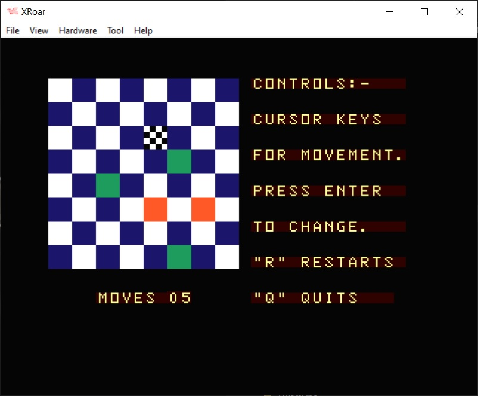

This is a 6809 assembly language game for the Dragon 32 that challenges you to move a chequered cursor around a standard 8x8 chess board, moving as the knight does in chess.

The program was originally developed by Pat McCabe and Colin Turner and was publish in the May 1986 edition of Dragon User magazine. 

| File | Description |
| --- | --- |
| build.bat |  A windows batch file to assemble and run the program file.  1.  Set the path to asm6809 and XROAR (change as required)    2.  Assemble the code file using asm6809   3.  Run the resulting NiteMove.bin file in XROAR |
| NiteMove.asm | The assembly code file |
| NiteMove_AllDream.cas | An Alldream version of the assembly code file |
| NiteMove.cas | The assembled game file. |

Please note, asm6809 and XROAR(and associated ROMS) are not included, but can be downloaded from the following locations: 
https://www.6809.org.uk/xroar/   https://www.6809.org.uk/asm6809/

To run the game without assembling the code file:
+ Download NiteMove.cas to your device
+ Open a browser and paste the following URL:  https://www.6809.org.uk/xroar/online/
+ Under the emulation screen, click the File tab
+ Click the load button, and select the downloaded NiteMove.cas
+ In the emulation screen, type the following: CLOADM:EXEC   <press enter>
                
In order for this game to run on the TRS-80 Color Computer, the following ROM sub-routines will need to be amended....

| Dragon 32 | TRS-80 | Description |
| --- | --- | --- |
| $8006 (32774) | $A1C1 (41409) | POLCAT: scans keyboard and puts the character in A Register  |
| $90E5 (37093) | $B99C (47516) | Outputs a text string to device number in DEVN (defaults to screen) | 
| $978E (38798) | $BF1F (48927) | Generate an 8 bit random number and put it in location 278 |
| $B3B4 (46004) | $A027 (40999) | RESET:resets whole works, as if reset button has been pressed  |
| $BA77 (47735) | $A928 (43304) | CLEAR SCREEN: clears screen to space and 'homes' cursor |

        
